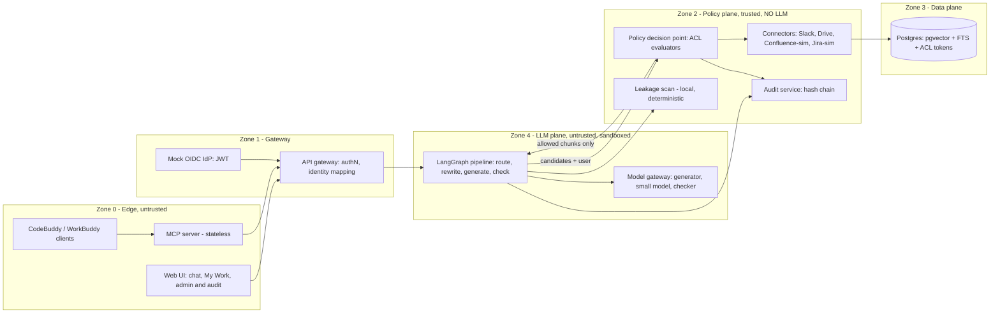

# 01 · Architecture

## Zones and trust boundaries

Rules that define the boundaries:
- **Zone 4 (LLM plane)** gets only sanitized, already-authorized context. No credentials, no network except to the policy plane, no write tools.
- **Zone 2 (policy plane)** is plain deterministic code. No LLM may influence an allow/deny decision.
- Denied content never leaves Zone 2, and is never sent to any model or third party. The leakage scan against denied content runs locally.
- Credentials for source systems live only in connectors (Zone 2), with read-only least-privilege scopes.

## Query path (LangGraph state machine; policy nodes are plain code)
1. **Authenticate and resolve identity:** JWT, then per-platform identities (email, Slack ID, Jira accountId) and group memberships.
2. **Context profile and routing (small model):** intent, which platforms and which skill, resolve references ("our migration"), semantic query plus keyword variants.
3. **ACL-prefiltered hybrid retrieval:** per-platform fan-out, BM25 + vectors filtered on the asker's ACL tokens (GIN index), reciprocal-rank fusion, optional rerank.
4. **Just-in-time verification (PDP):** for each top-k candidate, call the connector's `check_access` (short-TTL cache) and compare the source `version` to the indexed version. Stale content is re-fetched inline (read-through). Allow/deny recorded per document.
5. **Link-edge expansion:** follow Jira, Slack, Confluence and Drive links only if the target also passes the PDP.
6. **Context engineering:** build the **context packet** (per-source quotas, dedupe, snippet compression, ordering, token budget, ACL labels, freshness). See [context-packet](02-contracts/context-packet.md).
7. **Sanitize and spotlight:** wrap chunks in delimiters, strip instruction-like text, flag it.
8. **Generate:** structured claims, each with source chunk IDs (the selected skill shapes the procedure and format).
9. **Check:** layer 1 deterministic (citations exist and are visible; local denied-set leakage scan); layer 2 local grounding model; layer 3 small chat model for hard cases. If support is missing, abstain or redact.
10. **Uniform refusal:** denied and nonexistent content produce the same shape and similar timing; no counts, no titles.
11. **Audit write:** who, query, retrieved IDs, allow/deny per document, ACL snapshot hash, policy version, answer hash, model versions, timestamp, chained by hash.

## Freshness
Event-driven ingestion (Slack Events API, Drive `changes.watch`, simulator webhooks) plus an incremental poll as a fallback. Every citation shows an "as of" time. A dashboard shows freshness lag p50/p95. Read-through version checks at query time bound staleness regardless of ingestion lag.

## Audit and compliance
Hash-chained log with signed checkpoints and a `/verify` endpoint. Natural-language audit queries are answered by a read-only audit agent that is itself under RBAC. Denied document IDs are stored salted-hashed. Entries store the ACL snapshot hash and policy version so decisions are replayable.

## Data plane
Postgres with pgvector, full-text search and a GIN index on `acl_tokens[]`. Source-native ACL evidence is stored next to normalized tokens. Embeddings: local **bge-m3** by default. Every vector stores `embedding_model` and `embedding_version`. See [ADR-002](05-decisions/ADR-002-embeddings.md) and [ADR-006](05-decisions/ADR-006-storage.md).

## Key trade-offs (for the architecture diagram submission)
| Choice | Trade-off |
|---|---|
| Prefilter plus JIT re-check | Extra latency and source API calls, in exchange for closing the revocation window |
| Own policy decision point, not OpenFGA/SpiceDB | Faster to build and keeps native semantics, but less general; production path is OpenFGA/SpiceDB |
| Local embeddings and local checker | Privacy and no rate limit, but CPU cost on the deployment server |
| Real Slack/Drive, simulated Confluence/Jira | Fidelity where free APIs allow it; simulators give scale and permission semantics the free Atlassian plan lacks |
| Stateless MCP | Per-request authorization and easy scaling; no server-initiated streaming |
| Single Postgres | One system to run and secure; less specialized than a dedicated vector DB |

## Sandboxing
LLM-plane code runs with no egress except to the policy plane and the model gateway. Candidate: Tencent's open-source CubeSandbox (KVM isolation, per-sandbox network policy, egress allow-list that keeps keys out of the sandbox); fallback Docker with network policy. The handbook lists "Tencent Cloud Agent Runtime": confirm whether it is the same or compatible. See [06-risks-and-checks](06-risks-and-checks.md).
